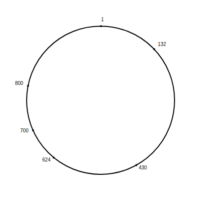
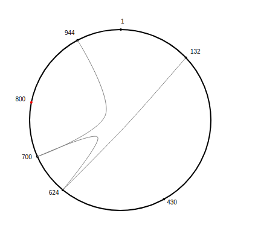

# Flask Chord DHT
Implementation of the Chord DHT Peer-to-Peer algorithm using [Flask](http://flask.pocoo.org/).  
Visualization of the network and key retrieval using [D3](https://d3js.org/) 

## Build front end
If you don't have node.js [download here](https://nodejs.org/en/download/)
```
cd visualize
npm install
webpack
```
If you have [yarn](https://yarnpkg.com/en/docs/install), you can use the `yarn` command instead.
You can edit the parameters in [visualize.html](./visualize/visualize.html) to preview how the front end works.
## Build back end
### Install requirements
Ensure you have [python](https://www.python.org/downloads/) installed.  
If you do not have virtualenv installed you can do so by `pip install virtalenv`  
Now you can make a virtual environment and install the requirements:
```
virtualenv .venv
pip install -r requirements.txt
source .venv/bin/activate
```
### Run nodes
Now you can initalize each dht server
```
python runserver.py -p=5000
python runserver.py -p=5001
python runserver.py -p=5002
# etc
```

### Join nodes
I used [postman](https://www.getpostman.com/apps) to send requests. You can also use [curl](https://curl.haxx.se/download.html)
```
curl --data $'localhost.localdomain:5001\nlocalhost.localdomain:5002' #etc
localhost.localdomain:5000/dht/join --header "Content-Type:text/plain"
```

### Put key
```
curl --data $'this is the value' localhost.localdomain:5000/db/keyval --header "Content-Type:text/plain"
```

### Get key
```
curl localhost.localdomain:5000/db/keyval
```

## Visualize network
Open in browser:
`localhost.localdomain:5000/dht/peers/view`

This is an example of what a visualization of the peer to peer network would look like:


## Visualize key path
`localhost.localdomain:5000/db/view/somekey`

This is an example of what a path would look like when trying to find the key

